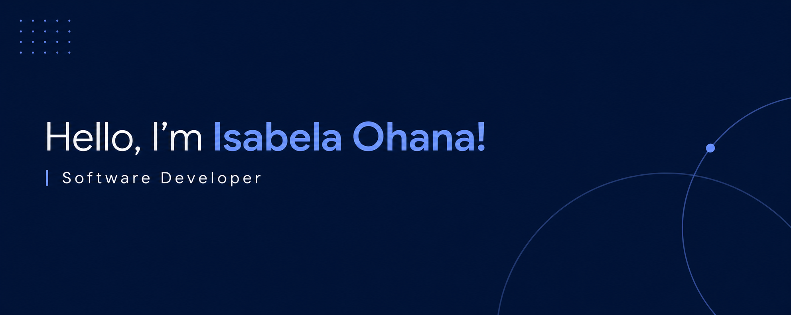

###

  

###

  

###

💻 Technology student passionate about programming and software engineering.    🚀 Always learning, building projects, and exploring new ideas in the world of technology.  🎓 Análise e Desenvolvimento de Sistemas | Universidade Christus

###

  
  
  
  
  
  
  
  
  
  
  
  
  
  
  
  
  
  
  
  
  
  
  
  
  
  
  
  
  
  
  
  
  
  
  
  
  

###

<picture>
  <source media="(prefers-color-scheme: dark)" srcset="https://raw.githubusercontent.com/isabelaohanadev/isabelaohanadev/output/pacman-contribution-graph-dark.svg">
  <source media="(prefers-color-scheme: light)" srcset="https://raw.githubusercontent.com/isabelaohanadev/isabelaohanadev/output/pacman-contribution-graph.svg">
  
</picture>
